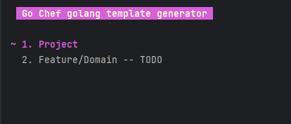
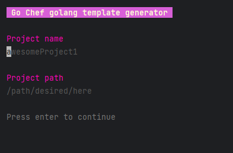

# go-chef


## Install
```bash
go install github.com/ihatiko/go-chef@latest
```

## interactive ui
```bash
go-chef
```




```bash
go-chef --help
```
	- go-chef
		interactive ui

	- go-chef cook-project
		create project by clean architecture
			--PROJECT_PATH 
				a path to the project
			--PROJECT_NAME
				project name

	- go-chef --help
		get a project description


